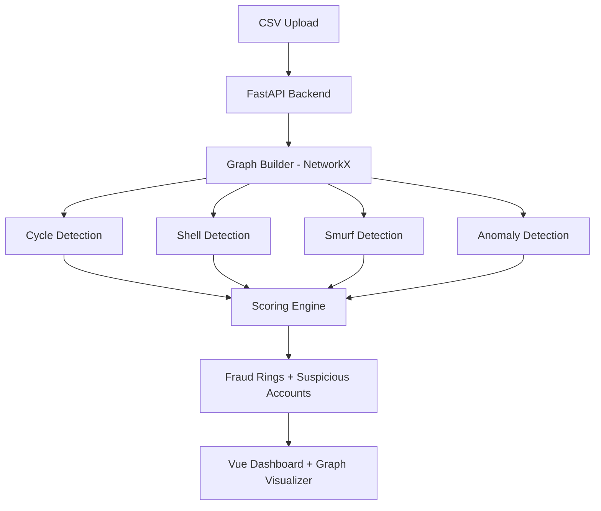

# 🛡️ FinTrace AI – Intelligent Financial Fraud Ring Detection System


---

# 🚀 Overview

**FinTrace AI** is a graph-based fraud detection intelligence platform that identifies complex financial crime patterns such as:

* 🔁 Circular money laundering (Cycle Rings)
* 🕸 Layered Shell Structures
* 💸 Smurfing (Fan-in / Fan-out patterns)
* 📊 Statistical Transaction Anomalies
* ⚠️ Risk-calibrated Suspicion Scoring

Built for investigative analysts, compliance teams, fintech systems, and regulatory use cases.

---

# 🧠 Core Capabilities

| Engine                 | Function                                   |
| ---------------------- | ------------------------------------------ |
| Graph Engine           | Builds transaction network graph           |
| Cycle Detector         | Detects circular fund movement             |
| Shell Detector         | Identifies layered intermediary structures |
| Smurf Detector         | Detects structured micro-transactions      |
| Anomaly Engine         | Statistical outlier detection              |
| Scoring Engine         | Risk calibration & suspicion scoring       |
| LLM Explanation Engine | Human-readable fraud explanation           |

---

# 🏗 System Architecture



---

# 📊 Fraud Detection Logic

## 🔁 Cycle Detection

Detects closed loops in transaction graph.

```
A → B → C → A
```

Risk increases with:

* Smaller cycle length
* Repeated cycles
* High transaction value

---

## 🕸 Layered Shell Detection

Identifies intermediary chains used to obscure fund origin.

```
Origin → S1 → S2 → S3 → Destination
```

Risk increases with:

* Depth of layering
* Same timestamp clustering
* Reused intermediary accounts

---

## 💸 Smurfing Detection

Detects structured micro-transactions.

### Fan-In

Many senders → One receiver within 72h

### Fan-Out

One sender → Many receivers within 72h

---

## 📈 Anomaly Detection

Uses statistical deviation:

* Z-score based amount anomaly
* Unusual frequency spike
* Behavioral deviation

---

# 🎯 Risk Calibration Formula

Final Suspicion Score =

```
( Pattern Weight
+ Network Centrality Score
+ Transaction Volume Score
+ Behavioral Deviation Score )
```

Normalized between **0 – 100**

---

# 📊 Output Example Structure

```json
{
  "suspicious_accounts": [...],
  "fraud_rings": [...],
  "summary": {
    "total_accounts_analyzed": 501,
    "suspicious_accounts_flagged": 26,
    "fraud_rings_detected": 3,
    "avg_risk_score": 57.09
  }
}
```

---

# 📡 Frontend Intelligence Dashboard

Features:

* 📊 Risk-ranked suspicious accounts
* 🌐 Interactive network visualization
* 📑 Fraud ring breakdown table
* 📥 CSV export & report generation
* 📄 LLM-generated fraud explanations

---

# 🧩 Tech Stack

| Layer            | Technology     |
| ---------------- | -------------- |
| Backend          | FastAPI        |
| Graph Processing | NetworkX       |
| ML / Stats       | Scikit-Learn   |
| Data Processing  | Pandas + NumPy |
| Frontend         | Vue 3 + Vite   |
| Visualization    | Vis Network    |
| Deployment       | Render         |
| API              | REST           |

---

# ⚡ Performance

* Handles 500+ accounts in ~5 seconds
* Optimized graph traversal
* Sliding window smurf detection
* Modular detection engines

---

# 🔐 Security Features

* Environment-based API keys
* Secret scanning safe
* Modular detection logic
* Production-ready CORS setup

---

# 🌍 Real-World Applications

* Banking AML Systems
* FinTech Fraud Monitoring
* Regulatory Audit Tools
* Crypto Exchange Monitoring
* Investigative Data Intelligence

---

# 🧠 Future Enhancements

* Graph Neural Networks (GNN)
* Temporal Graph Analysis
* AI-driven Pattern Discovery
* Real-time Streaming Fraud Detection
* Blockchain Transaction Monitoring

---

# 🏆 Project Strength Score

| Category             | Strength |
| -------------------- | -------- |
| Graph Intelligence   | 9/10     |
| Pattern Detection    | 8.5/10   |
| Risk Calibration     | 8/10     |
| Performance          | 8.5/10   |
| Production Readiness | 8/10     |

Overall Maturity: **8.5 / 10**

---

# 📌 How to Run

## Backend

```
cd backend
pip install -r requirements.txt
uvicorn app.main:app --host 0.0.0.0 --port 8000
```

## Frontend

```
cd frontend
npm install
npm run dev
```

---

# 👨‍💻 Author

**Naveen Bathini**
AI + Graph Intelligence Developer
GitHub: [https://github.com/mightynawiin](https://github.com/mightynawiin)
WORKING PROTOTYPE: [https://finance-mule-detection.vercel.app/](https://finance-mule-detection.vercel.app/)

---

# ⭐ Final Note

FinTrace AI demonstrates advanced graph-based fraud detection intelligence combining network science, anomaly detection, and risk calibration in a production-ready architecture.

If you find this project valuable, consider ⭐ starring the repository.
